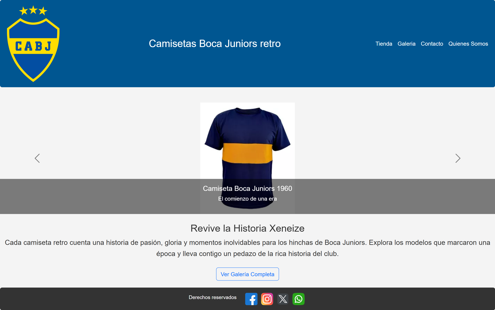
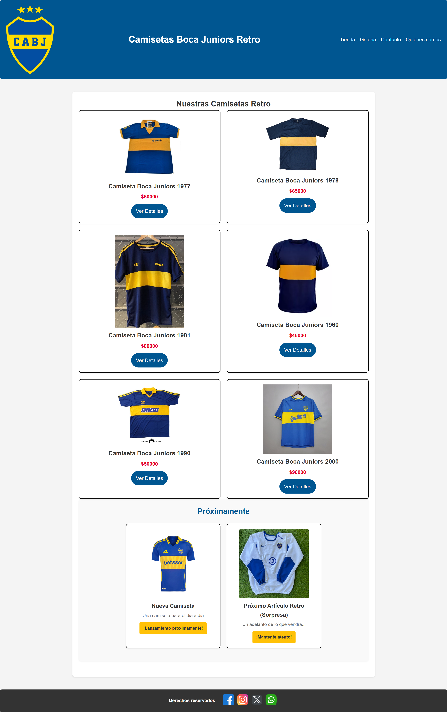

# Camisetas Boca Juniors Retro

Sitio web dedicado a la historia y venta de camisetas retro de Boca Juniors. Incluye galería, tienda, formulario de contacto y secciones informativas.

## 🚀 Demo online

[Ver sitio publicado](https://gonza2003.github.io/repo-proyecto1/)

## 📋 Características

- 5 secciones: Inicio, Tienda, Galería, Contacto, Quiénes Somos
- Responsive (adaptado a mobile y desktop)
- Animaciones y transiciones CSS
- SCSS modularizado y Bootstrap
- SEO optimizado (meta tags, sitemap)
- Navegación clara y enlaces internos

## 🛠️ Tecnologías usadas

- HTML5
- SCSS (SASS)
- Bootstrap 5
- Git y GitHub

## 📷 Capturas

## 👤 Autor

Gonzalo Mungiello  
[LinkedIn](www.linkedin.com/in/gonzalo-mungiello-7197a9255)

---

¡Gracias por visitar el proyecto!